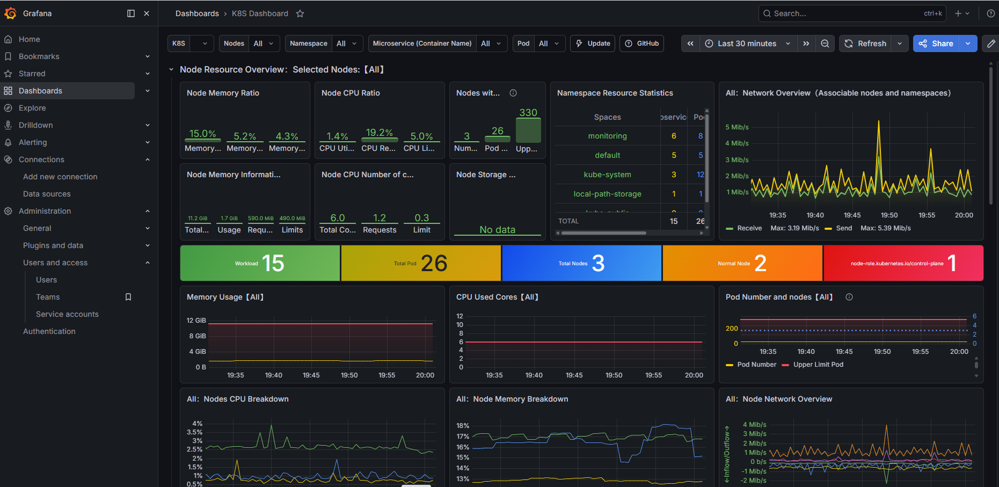
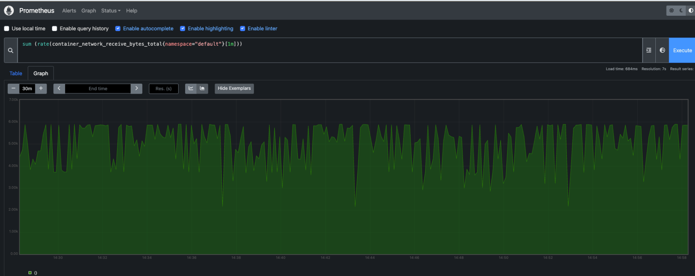

# Voting App

A comprehensive guide for setting up a Kubernetes cluster using Kind on an AWS EC2 instance, installing and configuring Argo CD, and deploying applications using Argo CD.

## Overview

This guide covers the steps to:
- Launch an AWS EC2 instance.
- Install Docker and Kind.
- Create a Kubernetes cluster using Kind.
- Install and access kubectl.
- Set up the Kubernetes Dashboard.
- Connect and monitor application using Prometheus and Grafana.

## Observability

* A front-end web app in [Python](/vote) which lets you vote between two options
* A [Redis](https://hub.docker.com/_/redis/) which collects new votes
* A [.NET](/worker/) worker which consumes votes and stores them in…
* A [Postgres](https://hub.docker.com/_/postgres/) database backed by a Docker volume
* A [Node.js](/result) web app which shows the results of the voting in real time

